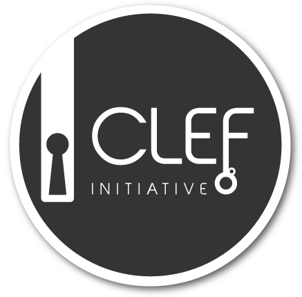
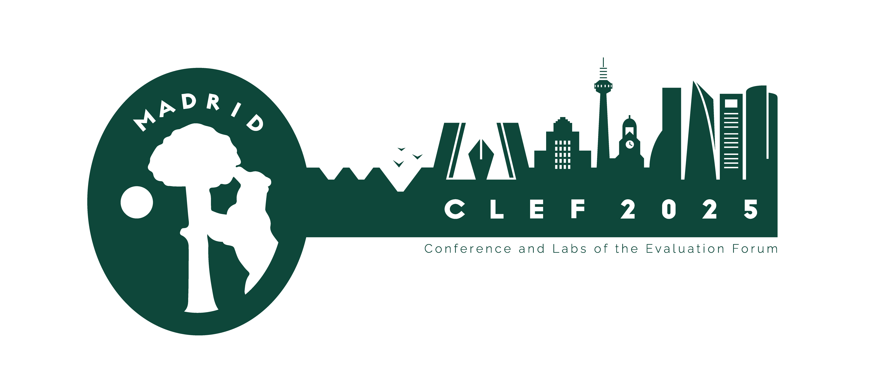

# CLEF 2025 SimpleText Track

---

  

## Simplify Scientific Text (and Nothing More)

The general public tends to avoid reliable sources such as scientific literature due to their complex language and lacking background knowledge. Instead, they rely on shallow and derived sources on the web and in social media - often published for commercial or political incentives, rather than informational value. Can text simplification help to remove some of these access barriers? The SimpleText track is a part of the CLEF initiative which promotes the systematic evaluation of information access systems, primarily through experimentation on shared tasks. SimpleText addresses the challenges of text simplification approaches in the context of promoting scientific information access, by providing appropriate data and benchmarks. The track uses a corpus of scientific literature abstracts and popular science requests. Our overall use case is to create a simplified summary of multiple scientific documents based on a popular science query which provides a user with an accessible overview of this specific topic.  
The track has the following four concrete tasks.
 
## [Tasks](./tasks)

- [Task 1](./tasks): Text Simplification: Simplify scientific text.
- [Task 2](./tasks): Controlled Creativity: Identify and avoid hallucination.
- [Task 3](./tasks): SimpleText 2024 Revisited : Selected tasks by popular request.

## How to participate

In order to participate, you should sign up at the [CLEF](https://clef2025.clef-initiative.eu/index.php?page=Pages/registration.html) website. The registration opens on 15th November 2024.

All team members should join the SimpleText mailing list:
[https://groups.google.com/g/simpletext](https://groups.google.com/g/simpletext). 

The data will be made available to all registered participants.

## Acknowledgement  

SimpleText is supported by the French research network on Big Data - Data Science [MADICS](https://www.madics.fr/). This research was funded, in whole or in part, by the French National Research Agency (ANR) under the project [ANR-22-CE23-0019-01](https://anr.fr/Project-ANR-22-CE23-0019). 

## References  

* L. Ermakova, E. SanJuan, S. Huet, H. Azarbonyad, G. M. Di Nunzio, F. Vezzani, J. D’Souza, J. Kamps,
_Overview of the CLEF 2024 SimpleText track: Improving access to scientific texts for everyone_, in:
Proceedings of CLEF'24, LNCS Volume 14958 + 14959, Springer, 2024 ([Paper](https://doi.org/10.1007/978-3-031-71908-0_13)).

* Eric Sanjuan, Stéphane Huet, Jaap Kamps, Liana Ermakova
_Overview of the CLEF 2024 SimpleText Task 1: Retrieve Passages to Include in a Simplified Summary_, 3115-3128
([Paper](https://ceur-ws.org/Vol-3740/paper-305.pdf)).

* Giorgio Maria Di Nunzio, Federica Vezzani, Vanessa Bonato, Hosein Azarbonyad, Jaap Kamps, Liana Ermakova
_Overview of the CLEF 2024 SimpleText Task 2: Identify and Explain Difficult Concepts_, 3129-3146
([Paper](https://ceur-ws.org/Vol-3740/paper-306.pdf)).

* Liana Ermakova, Valentin Laimé, Helen McCombie, Jaap Kamps
_Overview of the CLEF 2024 SimpleText Task 3: Simplify Scientific Text_, 3147-3162
([Paper](https://ceur-ws.org/Vol-3740/paper-307.pdf)).

* Jennifer D'Souza, Salomon Kabongo, Hamed Babaei Giglou, Yue Zhang
_Overview of the CLEF 2024 SimpleText Task 4: SOTA? Tracking the State-of-the-Art in Scholarly Publications_, 3163-3173
([Paper](https://ceur-ws.org/Vol-3740/paper-308.pdf)).

---

 
 
 
 

